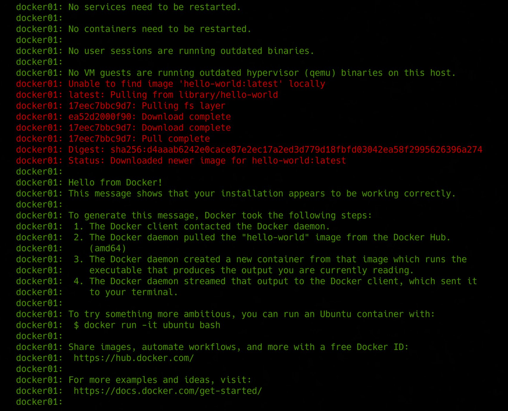

### 📌 Dockerize “Hello World”
---
**Goal:** create a Docker image that prints a message to the console when run.

### 👉 Demonstration
By running the command:

```bash
vagrant up
```

A virtual machine is created and provisioned with **Docker Engine**.
Once the provisioning process is complete, the `hello-world` Docker container is automatically executed, printing a message to the console.


---
