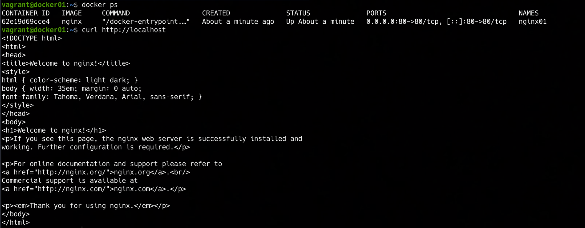

### 📌 Dockerized Nginx Web
---
**Goal:** create a Docker container that serves a web page using Nginx.

### 👉 Demonstration
By running the command:

```bash
vagrant up
```

A virtual machine is created and provisioned with **Docker Engine**.
Once the provisioning process is complete, an **Nginx container** is automatically executed, exposing a web page through port forwarding.

The application from the container is accessible from outside the VM via a web browser, thanks to port forwarding configured on both the VM and the container.


---
