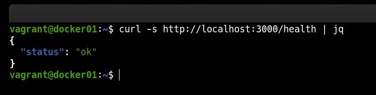

### 📌 Dockerized Python API
---
**Goal:** create a Docker image for a simple Python API listening on a configurable port.

### 👉 Demonstration
By running the command:

```bash
vagrant up
```

A virtual machine is automatically provisioned using Vagrant. Inside this virtual machine, Docker Engine is installed and used to build the Docker image that packages the FastAPI application. Once the image is built, a Docker container is created and started, exposing the API and making it available for incoming requests.

After the environment is up and running, the API can be accessed from both the host machine and the VM to verify its health and availability. For example, sending a request to the health endpoint using:

```bash
curl http://localhost:3000/health
```


---
