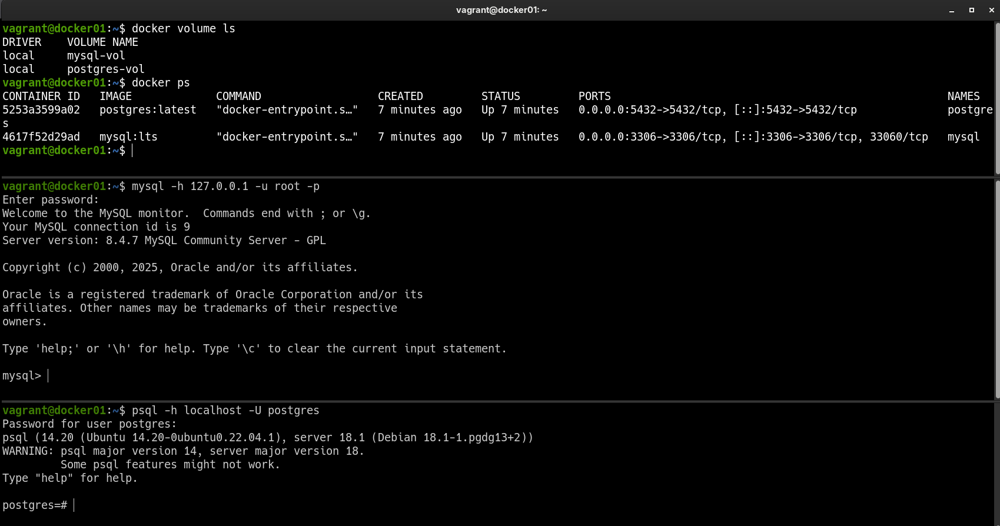

### 📌 Dockerized Database (MySQL / PostgreSQL)
---
**Goal:** create two Dockerized relational databases (MySQL and PostgreSQL, each one in a separate container) with individual persistent data storage, running inside a Vagrant-managed virtual machine.

### 👉 Demonstration
By running the command:

```bash
vagrant up
```

A virtual machine is automatically provisioned using Vagrant. Inside this virtual machine, Docker Engine is installed and used to pull and run Docker images for the selected database engines (MySQL and PostgreSQL).

The database containers are configured with:
* Exposed ports to allow connections from both the host machine and the VM
* Environment variables for database name, user, and password
* Docker volumes to ensure data persistence across container restarts and VM reboots

Once the container is running, the database services will be available and ready to accept connections.
We can verify connectivity from the host machine using:

```bash
mysql -h 127.0.0.1 -u root -p
```

```bash
psql -h localhost -U postgres
```

## 

