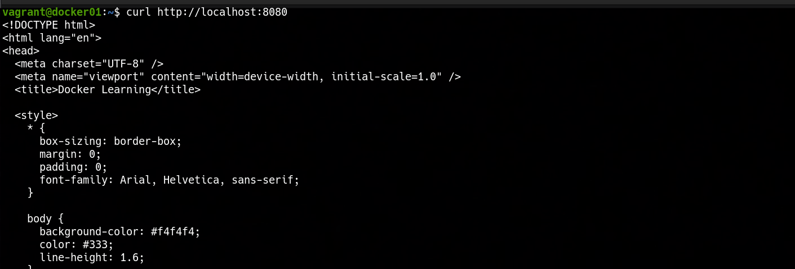

### 📌 Dockerized Web Server with a Bind Mount

---

**Goal:** create a Dockerized Nginx web server running inside a Vagrant-managed virtual machine, serving a static `index.html` file using a bind mount for persistent and easily editable content.

### 👉 Demonstration

By running the command:

```bash
vagrant up
```

A virtual machine is automatically provisioned using Vagrant. Inside this virtual machine, Docker Engine is installed and used to run an Nginx container.
The Nginx container is configured with:

* Exposed ports to allow access from both the host machine and the VM
* A bind mount to serve a custom `index.html` file
* A working directory inside the container aligned with the mounted path

Once the container is running, the Nginx service will be available and ready to serve the web application.

We can verify connectivity from the host machine by opening a browser and navigating to:

```text
http://localhost:8080
```

## 

