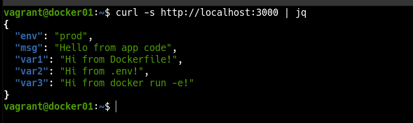

### 📌 Dockerized Environment Variables Priority (FastAPI)

---

**Goal:** create a Dockerized FastAPI application to learn and demonstrate how environment variables are injected from different sources (YAML config, Dockerfile, `.env`, `docker run -e`) and how priority/override rules work between them, all running inside a Vagrant-managed virtual machine.

### 👉 Demonstration

By running the command:

```bash
vagrant up
```

A virtual machine is automatically provisioned using Vagrant. Inside this virtual machine, Docker Engine is installed and used to build and run a Docker image containing a FastAPI application.

The application is designed to read configuration values from multiple sources:

* A YAML configuration file mounted via a Docker volume
* Build arguments defined at image build time
* Environment variables provided through a `.env` file
* Environment variables explicitly passed using `docker run -e`

Some variables are intentionally overridden to demonstrate **environment variable priority and precedence**.

The container is configured with:

* Exposed ports to allow access from the host machine
* A Docker volume to persist and share configuration files
* Build arguments and runtime environment variables

Once the container is running, the API will be available and ready to accept HTTP requests.
We can verify the final resolved values by querying the API from inside the VM:

```bash
curl -s http://localhost:3000 | jq
```

This clearly shows how variables defined later in the process override earlier ones.

## 

---
