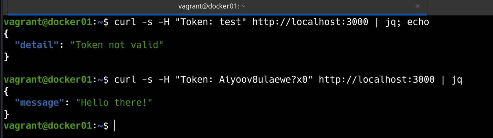

### 📌 Dockerized Secret-Backed API (FastAPI + Docker Secrets)

---

**Goal:** create a Dockerized FastAPI application that requires a secret token to access its endpoints. The secret is managed using **Docker Secrets** in a Swarm service, demonstrating secure configuration of sensitive data inside containers, all running inside a Vagrant-managed virtual machine.

### 👉 Demonstration

By running the command:

```bash
vagrant up
```

A virtual machine is automatically provisioned using Vagrant. Inside this virtual machine, Docker Engine is installed and used to build and run a Docker Swarm service containing a FastAPI application.

The application reads its secret token from a **Docker-managed secret file** mounted at `/run/secrets/app_token`. This token is required to authorize any HTTP request to the API.

The container/service is configured with:

* Exposed ports to allow access from the host machine
* Environment variable for the application port
* Docker Secrets for secure token injection

Once the service is running, the API will enforce authentication. Requests **must include the correct token** in the `Token` HTTP header:

```bash
curl -s -H "Token: <your_secret_token>" http://localhost:3000 | jq
```

Expected response when the correct token is provided:

```json
{
  "message": "Hello there!"
}
```

Requests without the token or with an incorrect token will return a **401 Unauthorized** error, demonstrating secure secret handling in Docker Swarm.

## 

---
