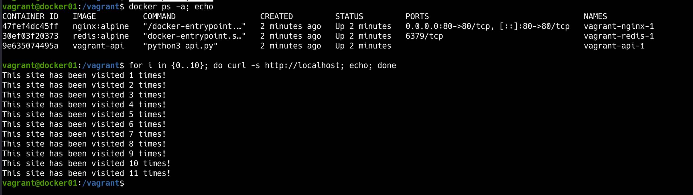

### 📌 Docker Compose Networking System (Nginx, API & Redis)

---

**Goal:** understand how **Docker** manages internal traffic, ensures **component isolation** using **internal and public networks**, and handles external access via a Reverse Proxy.

### 👉 Demonstration

By running the command:

```bash
vagrant up
```

A virtual machine is automatically provisioned using a custom ubuntu-jammy64 with docker-engine pre-installed and deploys a system via docker-compose.

The system consists of three main services:

* **Reverse Proxy (Nginx)**: Situated on the **public network** and **internal network**. It exposes port 80 to the world and forwards traffic to the API, acting as the single entry point.
* **API (Flask)**: Situated on an **internal network**. It handles the application logic and communicates with Redis. It is completely hidden from the outside world for security.
* **Database (Redis)**: Situated on an **internal network**. It stores the visit counters and is only accessible by the API service within the private network.

We can verify the status of the services and also that the system is working and collecting the visits on the guest VM:

## 

This approach highlights these key features:

* **Network Isolation**: The API and Redis have no public IP/ports; they are only reachable by Nginx.
* **Reverse Proxy**: Nginx acts as a shield, ensuring that external users never communicate directly with the backend logic.
* **Service Discovery**: The API connects to the database simply by using the hostname `redis`, without hardcoding IPs.

---
