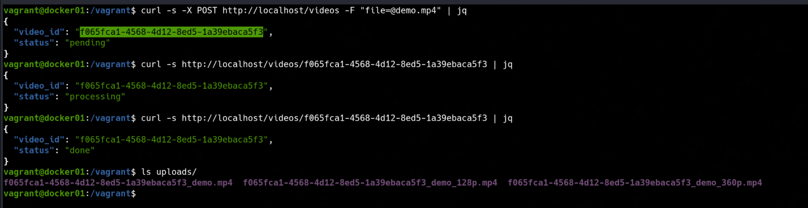

### 📌 Docker Compose Networks & Queues (Video Transcoding System)

---

**Goal:** understand how Docker Compose manages **multiple networks**, service isolation, and inter-service communication using a **message queue (RabbitMQ)** in a distributed video transcoding system, all running inside a Vagrant-managed virtual machine.

### 👉 Demonstration

By running the command:

```bash
vagrant up
```

A virtual machine is automatically provisioned using Vagrant. Inside this virtual machine, Docker Engine and Docker Compose are used to start a multi-service application. 

The system simulates a **video transcoding platform** composed of:

* **API (FastAPI)** → receives video uploads and publishes jobs to a queue
* **Worker** → consumes jobs from the queue and processes videos using FFmpeg, giving us the video in two more qualities (360p and 128p for keeping it light).
* **PostgreSQL** → stores video metadata and processing status
* **RabbitMQ** → message broker for asynchronous task processing

---

### 🔁 Queue-Based Processing Flow

The workflow is fully asynchronous:

1. A client uploads a video to:

   ```bash
   POST http://localhost/videos
   ```

2. The API:

   * Stores metadata in PostgreSQL
   * Publishes a message to the `video_tasks` queue in RabbitMQ

3. The Worker:

   * Listens to the `video_tasks` queue
   * Updates DB status to `processing`
   * Transcodes the video to multiple resolutions (128p, 360p)
   * Updates DB status to `done` (or `error` if it fails)

4. The client checks statusi and results:

## 

---

### 🔐 Service Configuration

The stack also demonstrates:

* Docker Secrets for database credentials
* Healthchecks for:

  * PostgreSQL
  * RabbitMQ
  * API
* `depends_on` with `condition: service_healthy`
* Shared volumes for uploaded files
* Durable RabbitMQ queues
* Restart policies (`unless-stopped`)

---
