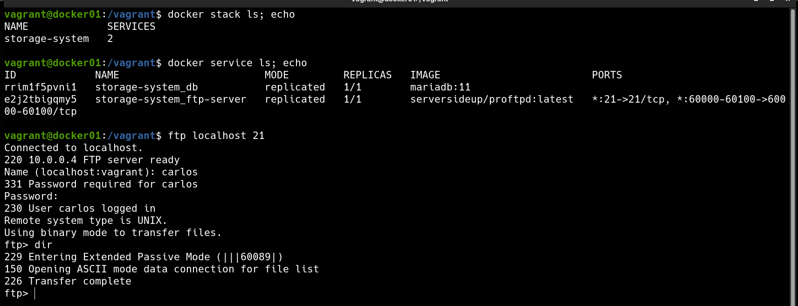

### 📌 Docker Compose Storage System (Networking, Secrets & Persistence)

---

**Goal:** understand how **Docker Compose** (deployed via Docker Stack) orchestrates a complex storage system, manages secure credentials via **Docker Secrets**, ensures **data persistence** with volumes, and isolates components using **internal and public networks**.

### 👉 Demonstration

By running the command:

```bash
vagrant up

```

A virtual machine is automatically provisioned using a custom ubuntu-jammy64 box that I uploaded, since it comes with Docker pre-installed, this saves us a lot of time.

The system consists of two main services:

* **Database (MariaDB)**: Situated on an **internal network**, it handles user authentication for the FTP server. It uses a persistent volume to ensure data isn't lost if the container restarts.
* **FTP Server (ProFTPD)**: Accessible from the **public network**. It communicates with the database via the internal network to verify credentials, keeping the database hidden from the outside world.

We can verify the status of the services and also that the FTP system is working on the guest VM:

## 

This approach highlights these key features:

* **Security**: Use of `docker secret` ensures sensitive passwords never appear in plain text in the Compose file or environment variables.
* **Network Isolation**: The database has no public IP/ports; it is only reachable by the FTP server through `internal_net`.
* **Persistence**: The `db_data` volume ensures the MariaDB registry survives container lifecycles.
* **Scalability**: Ready for Docker Swarm deployment with defined replicas and overlay drivers.

---
