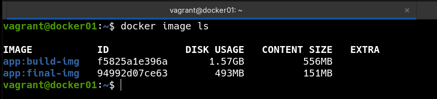

### 📌 Docker Multistage Build (Layers, Cache & Image Size)

---

**Goal:** understand how Docker **multistage builds** work, how layers and cache affect image creation, and how separating build and runtime stages drastically reduces final image size, all running inside a Vagrant-managed virtual machine.

### 👉 Demonstration

By running the command:

```bash
vagrant up
```

A virtual machine is automatically provisioned using Vagrant. Inside this virtual machine, Docker Engine is installed and used to build Docker images using a **multistage Dockerfile**.

The Dockerfile defines two stages:

* **Build image**: contains all build dependencies (Maven, Git, JDK) and compiles the application
* **Final image**: contains only the runtime environment (Tomcat + JRE) and the compiled artifact

The provisioning process builds both images explicitly to compare them:

```bash
docker build --target build_img -t app:build-img /vagrant/.
docker build --target final_img -t app:final-img /vagrant/.
```

We can inspect the resulting images and their sizes using:

```bash
docker image ls
```

This clearly shows the impact of multistage builds:

* The **build image** is large because it includes compilers, build tools, and source code
* The **final image** is significantly smaller because it only contains the runtime and the compiled `.war` file

This approach improves:

* Image size
* Security (fewer tools in production)
* Build cache efficiency
* Deployment speed

## 

---
