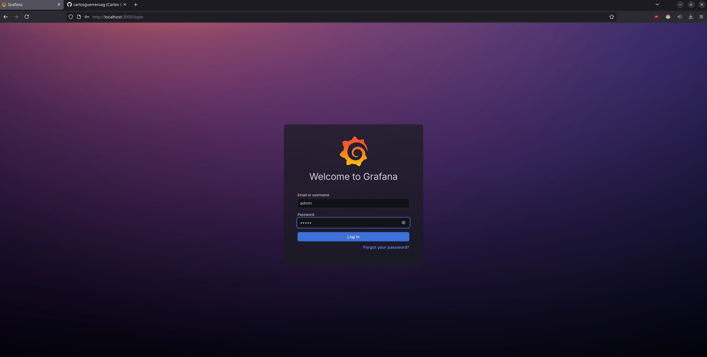
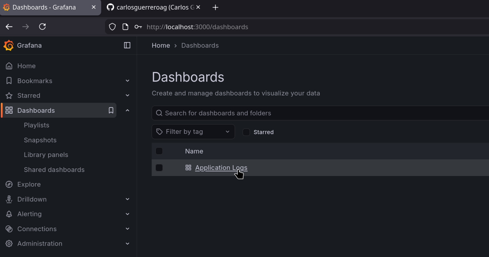
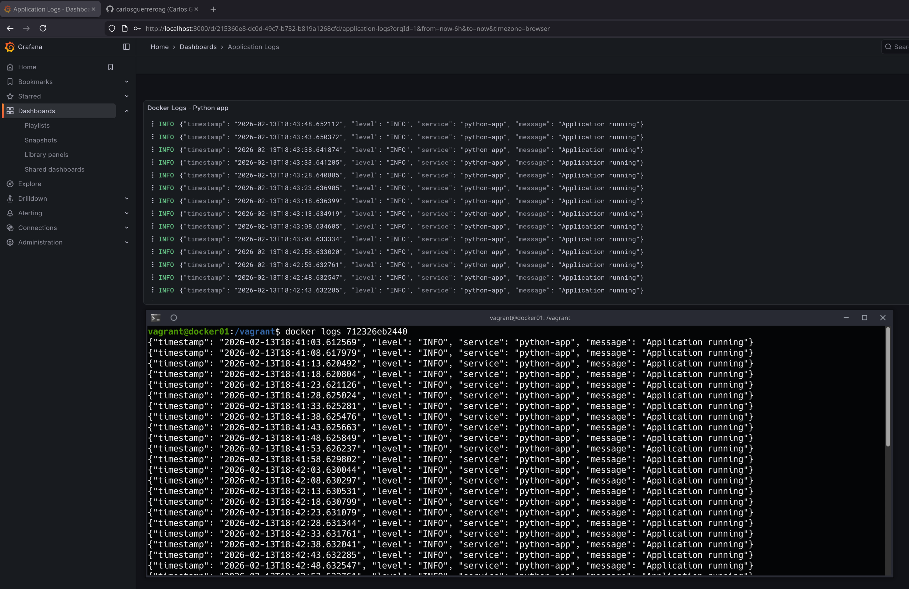

### 📌 Centralized Logging with Docker (Loki + Promtail + Grafana)

---

**Goal:** centralize logs from multiple containers into a single logging system, implementing a correct container logging strategy using stdout/stderr, log rotation, and centralized visualization, all running inside a Vagrant-managed virtual machine.

### 👉 Demonstration

By running the command:

```bash
vagrant up
```

A virtual machine is automatically provisioned using Vagrant. Inside this virtual machine, Docker Compose is used to start a centralized logging stack defined in `docker-compose.yaml`.

The system consists of:

* **Python application container** → emits structured logs to stdout
* **Promtail** → collects Docker container logs and ships them to Loki
* **Loki** → centralized log aggregation service
* **Grafana** → visualizes logs through pre-provisioned dashboards

---

### 🧩 Logging Architecture

The logging pipeline works as follows:

1. The Python application logs in **JSON format** to `stdout`
2. Docker stores logs using the `json-file` logging driver
3. Promtail reads container logs from:

   ```
   /var/lib/docker/containers
   ```
4. Promtail forwards logs to Loki
5. Grafana queries Loki and displays logs in a dashboard

The application uses a custom JSON logger:

```python
handler = logging.StreamHandler(sys.stdout)
```

This enforces the correct container logging practice:

* ✅ Log to stdout/stderr
* ❌ No internal file-based logging inside containers

---

### 🔄 Log Rotation

The Docker logging driver is configured with rotation:

```yaml
logging:
  driver: "json-file"
  options:
    max-size: "10m"
    max-file: "3"
```

This ensures:

* Log files do not grow indefinitely
* Automatic rotation when size exceeds 10MB
* Maximum of 3 rotated files retained

Failure scenarios (e.g., container crashes or misconfiguration) can be analyzed using:

* `docker logs`
* Grafana centralized logs view
* Loki queries

---

### 📊 Grafana Dashboard

Grafana is automatically provisioned with:

* Loki datasource
* Pre-configured logs dashboard
* Query:

  ```
  {job="python-app"}
  ```

Access Grafana at:

```
http://localhost:3000
```

You will see centralized logs from the Python application in real time.

## 
## 
## 

---

### 🎯 What This Project Demonstrates

* Centralized logging architecture
* Structured JSON logging
* Docker logging drivers
* Log rotation best practices
* Container debugging strategies
* Observability stack integration (Loki + Promtail + Grafana)
* No file-based logging inside containers (cloud-native approach)

---
